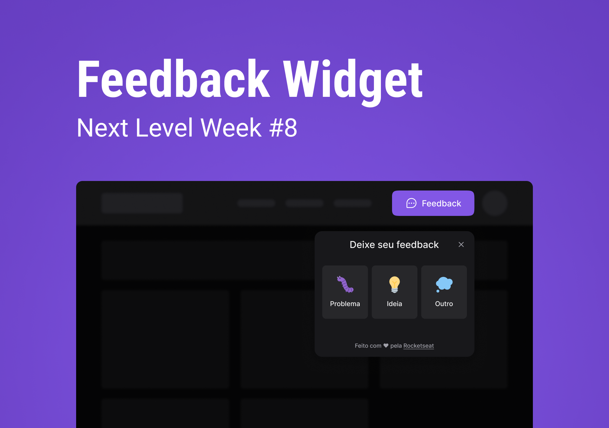

<h1 align="center">
  <br>Feedback Widget<br/>
  ViteJS | Expo | Node.js
  <br/>
  
  <br/>
  <a href="https://wakatime.com/badge/user/920a7e43-2969-4212-82ff-1b375685ff58/project/018c35d6-9829-4e6d-8ba4-7b292c040b24">
    
  </a>
</h1>

<p align="center">
  
  
  
  <br/>
</p>

<p align="center">
  <a href="#bookmark-about-the-project">About</a>&nbsp;&nbsp;&nbsp;|&nbsp;&nbsp;&nbsp;
  <a href="#rocket-technologies">Technologies</a>&nbsp;&nbsp;&nbsp;|&nbsp;&nbsp;&nbsp;
  <a href="#boom-how-to-execute">How to Execute?</a>&nbsp;&nbsp;&nbsp;|&nbsp;&nbsp;&nbsp;
  <a href="#memo-license">License</a>
</p>

## :bookmark: About the Project

The **Feedback Widget** is a wid get to get user feedback. It includes a small button that, when it's clicked, displays a form for the user give feedback. The feedback is sending to owners of the platform by email. O wid get is adaptable to different platforms.

This app was developed in **NLW Return**, the project by [Rocketseat](https://www.rocketseat.com.br/).

## :rocket: Technologies

- [Axios](https://github.com/axios/axios)
- [React Native Bottom Sheet](https://gorhom.github.io/react-native-bottom-sheet/)
- [Eslint](https://eslint.org/)
- [Expo](https://expo.io/)
- [Express](https://expressjs.com/)
- [Headless UI](https://headlessui.com/)
- [HTML2Canvas](https://html2canvas.hertzen.com/)
- [Husky](https://typicode.github.io/husky/)
- [Jest](https://jestjs.io/)
- [Nodemailer](https://nodemailer.com/)
- [NPM](https://www.npmjs.com/)
- [Phosphor Icons](https://phosphoricons.com/)
- [Prisma](https://www.prisma.io/)
- [ReactJS](https://reactjs.org/)
- [React Native](http://facebook.github.io/react-native/)
- [React Native Gesture Handler](https://docs.swmansion.com/react-native-gesture-handler/)
- [React Navigation](https://reactnavigation.org/)
- [React Reanimated](https://docs.swmansion.com/react-native-reanimated/)
- [Tailwind CSS](https://tailwindcss.com/)
- [TypeScript](https://www.typescriptlang.org/)
- [Vite](https://vitejs.dev/)

## :boom: How to Execute?

- ### **Prerequisite**

  - It's **necessary** to possess the **[Git](https://git-scm.com/)** installed and configured in your computer.
  - Also, it's **need** to have a package manager as **[Yarn](https://yarnpkg.com/)**, **[NPM](https://www.npmjs.com/)**, etc.
  - Finally, it's **necessary** to have [Node.js](https://nodejs.org/en) greater or equal version 16.

1. Make a clone of repository:

```sh
  $ git clone https://github.com/DanielAraldi/feedback-widget.git
```

2. Added environment variables:

```sh
  $ cd server # root of the projet
```

All right, create a new file called `.env`, you can use the file `.env.example` with base. After creating the file, execute the server using the following command: `npm run dev`.

```sh
  $ cd .. # go back to root of the projet
  $ cd web
```

Now, create also a new file called `.env.local`, you can use the file `.env.example` with base. Put the API URL as a variable value.

```sh
  $ cd .. # go back to root of the projet
  $ cd mobile
```

Here, create also a new file called `.env`, you can use the file `.env.example` with base. You can also put the API URL as a variable value, but it must be your IP and not `localhost`.

3. Executing the App:

```sh
  # Mobile
  $ cd mobile # root of the projet
  $ npm install # or yarn install to install the dependencies
  $ npm run start # yarn start to initialize app mobile

  # Web
  $ cd web # root of the projet
  $ npm install # or yarn install to install the dependencies
  $ npm run dev # yarn start to initialize app web

  # Server
  $ cd server # root of the projet
  $ npm install # or yarn install to install the dependencies
  $ npm run dev # yarn start to initialize server
```

## :memo: License

This project is sob MIT License. See on file [LICENSE](./LICENSE) for more details.

---

<sup>The project developed with tutoring of [Diego Fernandes](https://github.com/diego3g) and [Rodrigo Gonçalves](https://github.com/rodrigorgtic) from [Rocketseat](https://www.rocketseat.com.br/).</sup>
